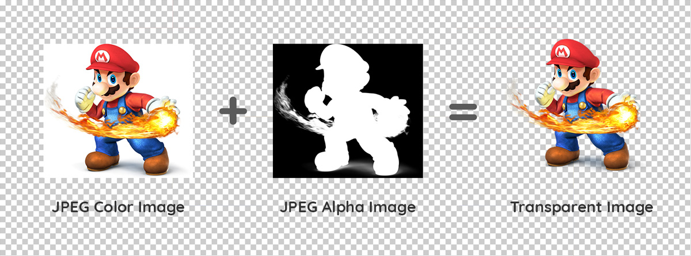

# vue-image-alpha

**`vue-image-alpha`** is a Vue component allowing to use light-weight transparent images on a website.

It is a remastered version of [imgAlpha.js](https://github.com/yannmasoch/imgAlpha.js) I ceated a few years ago. This `Vue` version has a more efficient code and a faster image processing running in the background using Web Workers and buffer images.


Suggestions are more than welcome, not only for feature requests but also for coding style improvements 😃


## How it Works
**vue-image-alpha** uses 2 compressed images such as jpeg format to build a light-weight transparent image. No more ugly GIF and no more heavy PNG!!

Simply save your image in 2 regular jpeg files:
1. The color image (on a plain color background)
2. The alpha image (black is transparent and white is opaque)



## Installation
**`vue-image-alpha`** is a `Vue component` that can be installed as dependency in you `Vue CLI` project.

The easiest way to install it is using NPM: 

```sh
npm install --save vue-image-alpha
```


## Usage

#### Component Initialization
All you need to do is to import `vue-alpha-image` in your `Vue` code

```javascript
import ImgAlpha from 'vue-image-alpha'
...

export default {
    name: 'MyApp',
    components: {
        ImgAlpha,
        ...
    },
    ...
},
```

#### Component Use
Use the component in your `html` or `template` code

```html
</img-alpha>
```

or with data binding
```html
</img-alpha>
```


## Props

Attribute | Type | Default | Description
------ | ---- | ------- | -----------
src | string | null | Color image URL
src-alpha | string | null | Alpha image URL
bg-color | string | #FFFFFF | The background color of the src image (optional)

#### scr
The `src` defines the color image source.

#### src-alpha
The `src-alpha` defines the alpha image used to make the color image transparent.

If the alpha image is not provided, the image transparency processing will be skipped and the image will be displayed as a regular image.

#### bg-color (optional)
The `bg-color` defines the background color of the color image. 

By default, the `bg-color` is white (`#FFFFFF`) 

This prop is used to provide a better alpha blending accuracy if you use a background color in the color image different than white.


## License

MIT License

Copyright (c) 2019 Yann Masoch

Permission is hereby granted, free of charge, to any person obtaining a copy
of this software and associated documentation files (the "Software"), to deal
in the Software without restriction, including without limitation the rights
to use, copy, modify, merge, publish, distribute, sublicense, and/or sell
copies of the Software, and to permit persons to whom the Software is
furnished to do so, subject to the following conditions:

The above copyright notice and this permission notice shall be included in all
copies or substantial portions of the Software.

THE SOFTWARE IS PROVIDED "AS IS", WITHOUT WARRANTY OF ANY KIND, EXPRESS OR
IMPLIED, INCLUDING BUT NOT LIMITED TO THE WARRANTIES OF MERCHANTABILITY,
FITNESS FOR A PARTICULAR PURPOSE AND NONINFRINGEMENT. IN NO EVENT SHALL THE
AUTHORS OR COPYRIGHT HOLDERS BE LIABLE FOR ANY CLAIM, DAMAGES OR OTHER
LIABILITY, WHETHER IN AN ACTION OF CONTRACT, TORT OR OTHERWISE, ARISING FROM,
OUT OF OR IN CONNECTION WITH THE SOFTWARE OR THE USE OR OTHER DEALINGS IN THE
SOFTWARE.